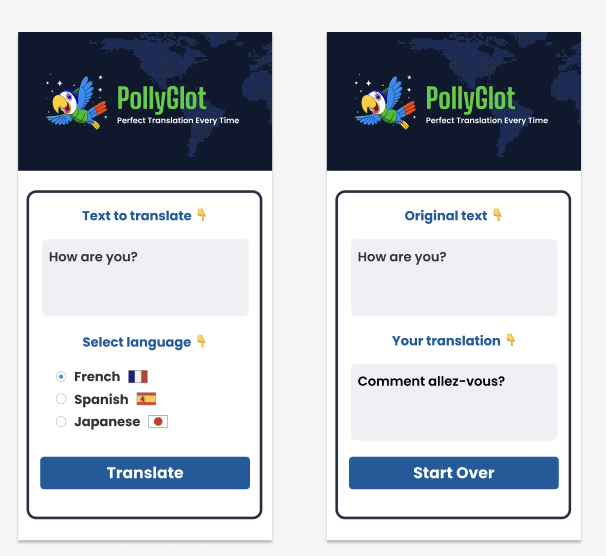

# Scrimba - Translation via AI Project
Translation app built with AI for Scrimba's AI Engineering course.

## Design

## Requirements
- Ask user for text to translate, and language to translate to.
- Translate via AI.

## Technology
- Uses Claude AI
- Uses Express for backend
- Uses React
- Built using Vite